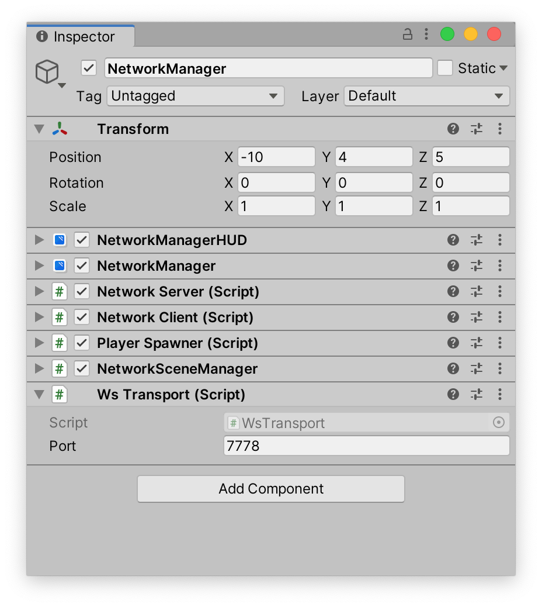

MirrorNG Websocket is a transport for [MirrorNG](https://github.com/MirrorNG/MirrorNG) suitable for building and running webgl clients.

This is based on the [Ninja Websockets](https://github.com/ninjasource/Ninja.WebSockets), a pure C# library for serving and consuming websockets.

## Documentation
Check out our [Documentation](https://mirrorng.github.io/MirrorNG_Websocket/).

## Installation
The preferred installation method is Unity Package manager.

If you are using unity 2019.3 or later: 

1) Open your project in unity
2) Install [MirrorNG](https://github.com/MirrorNG/MirrorNG)
3) Click on Windows -> Package Manager
4) Click on the plus sign on the left and click on "Add package from git URL..."
5) enter https://github.com/MirrorNG/MirrorNG_Websocket.git?path=/Assets/Mirror
6) Unity will download and install MirrorNG Websocket

Alternatively you can download it from [Download Mirror](https://github.com/MirrorNG/MirrorNG_Websocket/releases).  You will need to install some dependencies yourself such as cecil.

## Usage

1) In Unity create a NetworkManager gameobject from the GameObject -> Networking -> NetworkManager.
2) Then remove the TcpTransport (the default transport), and add a WsTransport.
3) Update the Transport reference in the NetworkManager, NetworkClient and NetworkServer components.

## Examples
We included several small example projects.

## Contributing

There are several ways to contribute to this project:

* Pull requests for bug fixes and features are always appreciated.
* Pull requests to improve the documentation is also welcome
* Make tutorials on how to use this
* Test it and open issues
* Review existing pull requests
* Donations

When contributing code, please keep these things in mind:

* [KISS](https://en.wikipedia.org/wiki/KISS_principle) principle. Everything needs to be **as simple as possible**. 
* An API is like a joke,  if you have to explain it is not a good one.  Do not require people to read the documentation if you can avoid it.
* Follow [C# code conventions](https://docs.microsoft.com/en-us/dotnet/csharp/programming-guide/inside-a-program/coding-conventions).
* Follow [SOLID principles](https://en.wikipedia.org/wiki/SOLID) as much as possible. 
* Keep your pull requests small and obvious,  if a PR can be split into several small ones, do so.

